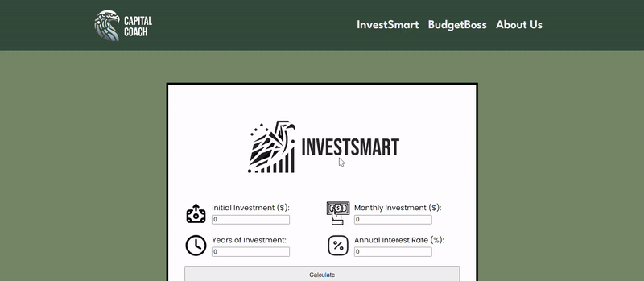

# Capital Coach

Welcome to **Capital Coach**, our innovative financial tool crafted with dedication at ConUHacks VIII. This project is a collaborative effort of our team comprising of Timothy (TJ) Klint, Zachary Dube, Lucas Lalumiere, and Dylan Savelson. Capital Coach is designed to empower individuals with smart financial planning tools, integrating simplicity with effectiveness.

## Features

### InvestSmart
InvestSmart makes investment planning straightforward and accessible. Users simply input their initial investment amount, monthly contributions, the number of years they plan to invest, and the average expected interest rate. InvestSmart then provides a clear projection of future financial growth, helping users to make informed investment decisions.

### BudgetBoss
Budgeting is made easy with BudgetBoss. Users input their monthly take-home pay, expenditures on monthly needs and wants, savings, and the budget rule they wish to follow. BudgetBoss analyzes this information and provides practical advice for a more efficient and sustainable budget, guiding users towards better financial health.

### CapitalCoach Chatbot
Powered by Botpress, the CapitalCoach Chatbot is your go-to source for any queries related to our site. This intuitive chatbot offers quick and reliable answers to a wide range of questions, ensuring users get the most out of our platform.

## Getting Started
(Provide instructions here on how to install, set up, and use Capital Coach.)

## Our Team + Contact:
For any further inquiries or suggestions, feel free to reach out to our team members:
- [Timothy Klint](https://github.com/tjklint) - timothyjklint@gmail.com
- [Dylan Savelson](https://github.com/DylanSavelson)
- [Lucas Lalumiere](https://github.com/Shlucus) - lucas.lalum@gmail.com
- [Zachary Dube](https://github.com/CompSciZach)

Thank you for exploring Capital Coach, where we strive to simplify and enhance your financial journey!
